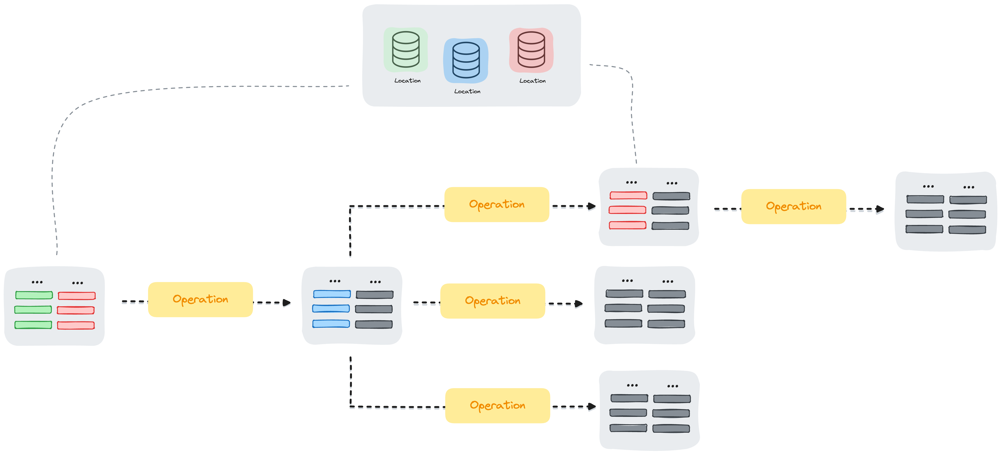

<a id="top"></a>
<p align="center">
    
</p>
<p align="center">
    <i>
        <b>Production-ready</b> 
        data processing made 
        <b>easy</b> 
        and 
        <b>shareable</b>
    </i>
    <br>
    <a href="http://fondant.ai"><strong>Explore the docs »</strong></a>
    <br>
    <br>
    <a href="https://discord.gg/HnTdWhydGp"></a>
    <a href="https://pypi.org/project/fondant/"></a>
    <a href="https://fondant.readthedocs.io/en/latest/license/"></a>
    <a href="https://github.com/ml6team/fondant/actions/workflows/pipeline.yaml"></a>
    <a href="https://coveralls.io/github/ml6team/fondant?branch=main"></a>
</p>
<br>

## 🪤 Why Fondant?

Fondant is a data framework that enables collaborative dataset building. It is designed for developing and crafting datasets together, sharing reusable operations and complete data processing trees. 

Fondant enables you to initialize datasets, apply various operations on them, and load datasets from other users. It assists in executing operations on managed services, sharing operations with others, and keeping track of your dataset versions. Fondant makes this all possible without moving the source data.


## 💨 Getting Started

Fondant allows you to easily define workflows comprised of both reusable and custom components. The following example uses the reusable load_from_hf_hub component to load a dataset from the Hugging Face Hub and process it using a custom component that will resize the images resulting in a new dataset.


```pipeline.py
import pyarrow as pa

from fondant.dataset import Dataset

raw_data = Dataset.create(
    "load_from_hf_hub",
    arguments={
        "dataset_name": "fondant-ai/fondant-cc-25m",
        "n_rows_to_load": 100,
    },
    produces={
        "alt_text": pa.string(),
        "image_url": pa.string(),
        "license_location": pa.string(),
        "license_type": pa.string(),
        "webpage_url": pa.string(),
        "surt_url": pa.string(),
        "top_level_domain": pa.string(),
    },
)

images = raw_data.apply(
    "download_images",
    arguments={
        "input_partition_rows": 100,
        "resize_mode": "no",
    },
)

dataset = images.apply(
    "resize_images",
    arguments={
        "resize_width": 128,
        "resize_height": 128,
    },
)

```
Custom use cases require the creation of custom components. Check out our [**step by step guide**](https://fondant.ai/en/latest/guides/first_dataset/) to learn more about how to build custom pipelines and components.

<p align="right">(<a href="#top">back to top</a>)</p>

### Running your pipeline

Once you have a pipeline you can easily run (and compile) it by using the built-in CLI:

```bash
fondant run local pipeline.py
```

To see all available runner and arguments you can check the fondant CLI help pages

```bash
fondant --help
```

Or for a subcommand:

```bash
fondant <subcommand> --help
```

<p align="right">(<a href="#top">back to top</a>)</p>


## 🪄 How Fondant works

- **Dataset**: The building blocks, a dataset is a collection of columns. Fondant operates uniquely via datasets. We start with a dataset, we augment it into a new dataset and we end with a dataset. Fondant optimizes the data transfer by storing and loading columns as needed. While also processing based on the available partitions. The aim is to make these datasets sharable and allow users to create their own datasets based on others.
- **Operation**: A transformation to be applied on a dataset resulting in a new dataset. The operation will load needed columns and produce new/altered columns. A transformation can be anything from loading, filtering, adding a column, writing etc. Fondant also makes operations sharable so you can easily use an operation in your workflow.
- **Shareable trees**: Datasets are a result of applying operations on other datasets. The full lineage is baked in. This allows for sharing not just the end product but the full history, users can also easily continue based on a dataset or branch off of an existing graph.



<p align="right">(<a href="#top">back to top</a>)</p>

## 🧩 Key Features

Here's what Fondant brings to the table: 
- 🔧 Plug ‘n’ play composable data processing workflows
- 🧩 Library containing off-the-shelf reusable components
- 🐼 A simple Pandas based interface for creating custom components
- 📊 Built-in lineage, caching, and data explorer
- 🚀 Production-ready, scalable deployment
- ☁️ Integration with runners across different clouds (Vertex, Sagemaker, Kubeflow)

👉 **Check our [Component Hub](https://fondant.ai/en/latest/components/hub/) for an overview of all 
available components**

<p align="right">(<a href="#top">back to top</a>)</p>

## 🪄 Example pipelines

We have created several ready-made example pipelines for you to use as a starting point for exploring Fondant. 
They are hosted as separate repositories containing a notebook tutorial so you can easily clone them and get started:

📖 [**RAG tuning pipeline**](https://github.com/ml6team/fondant-usecase-RAG)  
End-to-end Fondant pipelines to index and evaluate RAG (Retrieval-Augmented Generation) systems.

🛋️ [**ControlNet Interior Design Pipeline**](https://github.com/ml6team/fondant-usecase-controlnet)  
An end-to-end Fondant pipeline to collect and process data for the fine-tuning of a ControlNet model, focusing on images related to interior design.

🖼️ [**Filter creative common license images**](https://github.com/ml6team/fondant-usecase-filter-creative-commons)  
An end-to-end Fondant pipeline that starts from our Fondant-CC-25M creative commons image dataset and filters and downloads the desired images.

## ⚒️ Installation

First, run the minimal Fondant installation:

```
pip install fondant
```

Fondant also includes extra dependencies for specific runners, storage integrations and publishing 
components to registries. The dependencies for the local runner (docker) is included by default.

For more detailed installation options, check the [**installation page**](https://fondant.ai/en/latest/guides/installation/)on our documentation.


## 👭 Contributing

We welcome contributions of different kinds:

|                                  |                                                                                                                                                                                                                                                                                                                                                                                                                                                                               |
|----------------------------------|-------------------------------------------------------------------------------------------------------------------------------------------------------------------------------------------------------------------------------------------------------------------------------------------------------------------------------------------------------------------------------------------------------------------------------------------------------------------------------|
| **Issues**                       | If you encounter any issue or bug, please submit them as a [Github issue](https://github.com/ml6team/fondant/issues). You can also submit a pull request directly to fix any clear bugs.                                                                                                                                                                                                                                                                                      |
| **Suggestions and feedback**     | Our roadmap and priorities are defined based on community feedback. To provide input, you can join [our discord](https://discord.gg/HnTdWhydGp) or submit an idea in our [Github Discussions](https://github.com/ml6team/fondant/discussions/categories/ideas).                                                                                                                                                                                                               |
| **Framework code contributions** | If you want to help with the development of the Fondant framework, have a look at the issues marked with the [good first issue](https://github.com/ml6team/fondant/issues?q=is%3Aopen+is%3Aissue+label%3A%22good+first+issue%22) label. If you want to add additional functionality, please submit an issue for it first.                                                                                                                                                     |
| **Reusable components**          | Extending our library of reusable components is a great way to contribute. If you built a component which would be useful for other users, please submit a PR adding them to the [components/](https://github.com/ml6team/fondant/tree/main/src/fondant/components) directory. You can find a list of possible contributable components [here](https://github.com/ml6team/fondant/issues?q=is%3Aissue+is%3Aopen+label%3A%22Components%22) or your own ideas are also welcome! |

For a detailed view on the roadmap and day to day development, you can check our [github project
board](https://github.com/orgs/ml6team/projects/1).

You can also check out our [architecture](https://fondant.ai/en/latest/architecture/) page to familiarize yourself with the Fondant architecture and repository structure.

### Environment setup

We use [poetry](https://python-poetry.org/docs/) and [pre-commit](https://pre-commit.com/) to enable a smooth developer flow. Run the following commands to
set up your development environment:

```shell
pip install poetry
poetry install --all-extras
pre-commit install
```

<p align="right">(<a href="#top">back to top</a>)</p>

