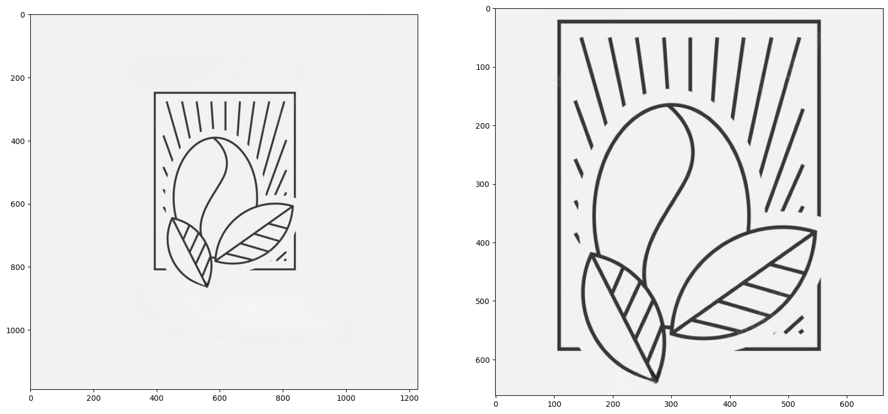
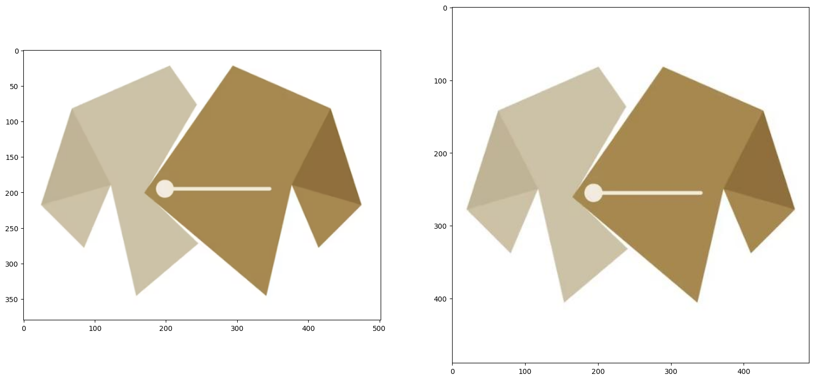

# Image cropping component

## Description
This component is based on the `TransformComponent` and is used to crop out image borders. This is typically useful when working with graphical images that have single-color borders (e.g. logos, icons, etc.).

## Usage
The component takes an image and calculates which color is most present in the border. It then crops the image in order to minimize this single-color border. The `padding` argument will add extra border to the image before cropping it, in order to avoid cutting off parts of the image.
The resulting crop will always be square. If a crop is not possible, the component will return the original image.

## Examples
Examples of image cropping by removing the single-color border. Left side is original image, right side is border-cropped image.

