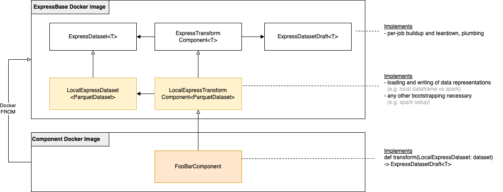
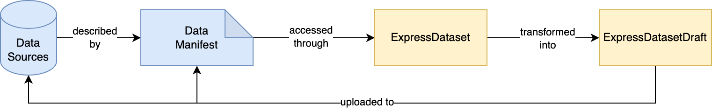

# Docs

This file contains general documentation on Express.

## Express: built around manifests

Express provides helper functions and boilerplate to speed up the creation of KubeFlow components and pipelines.

### Helpers

Express contains a few helper modules:

- `io.py`: general I/O helper functions.
- `kfp.py`: include helper functions for GPU logging when running a KFP component and parsing specific KFP input.
- `logger.py`: general logger module for event logging.
- `manifest.py`: Defines the structure of the data manifest that holds the location and contents of the different data sources.
- `storage_helpers.py`: helper functions to interact with Google Cloud Storage (blob listing, I/O, ...)

Those helper functions can be used when creating components.

### Component base classes

The `express.components` module contains component base classes which you can overwrite to create components. Each of these component classes always have 2 variants; a loader and a transform version.

**Available implementations**
1. Non-distributed Pandas implementation.\
    - `express_components.pandas_components.{PandasTransformComponent, PandasLoaderComponent}`
    - Data is exposed as a Pandas `DataFrame`. Depending on the use-case, consumers can do batch transforms, or collect data in-memory to a Pandas `DataFrame`.

**Planned implementations**
1. Spark-based components and base image.

To implement your own Transform component, you'll need to take a dependency on the `express` package and subclass one of the TransformComponent base classes. 

```python
from express.components.pandas_components import PandasTransformComponent, PandasDataset, PandasDatasetDraft

class MyFirstTransform(PandasTransformComponent):
    @classmethod
    def transform(cls, data: PandasDataset, extra_args: Optional[Dict] = None) -> PandasDatasetDraft:
        
        # Reading data
        index: pd.Series = data.load_index()
        my_data: pd.DataFrame = data.load("my_data_source")
        
        # filter index 
        index = index.filter(items:<list of ids to filter>)
        
        # Transforming data
        my_data = my_data.apply(<transformation_function>)
       
        return data.extend() \
            .with_index(index) \
            .with_data_source("my_transformed_data_source", my_data)
```

Next, you need to implement the Docker entrypoint:

```
if __name__ == '__main__':
    MyFirstTransform.run()
```

#### Taking a dependency on express
There are two ways to add `express` to your dependencies.

1. (Recommended) Build the `common` docker image, and have your component use this as a base image. This base image will include the `express` python package, and itself extends a PyTorch GPU image.
2. `express` can be installed as a standalone Python package into your custom images. See the Dockerfile of the `common` base image for an example implementation.

### Adding additional Transform/Loader base implementations

Different implementations mainly differ in how they expose the data, and what data manipulation capabilities are exposed at runtime.

If you want a different data manipulation runtime, use different data structures, or do other component-level bootstrapping across multiple jobs, you could add another base implementation for the `ExpressTransformComponent` / `ExpressLoaderComponent`.

A general overview of the different implementation levels can be seen in Figure 2. Additional base implementations work on the middle layer, and mainly affect data loading / writing logic.



More specifically, you'll need to subclass the `ExpressDatasetHandler` mix-in and implement the abstract dataset reading / writing methods.

Look at `express_components/pyarrow_components.py` for an example implementation.

## Express concepts

Manifest handling, dataset loading and writing are moderate-complexity recurring patterns across different express components.

To make implementing express components as lightweight as possible, Express provides a python package and base docker image that takes care of this heavy lifting, and makes it easy to implement many data transformations out of the box.

### 1.a) DataManifests, ExpressDatasets and ExpressDatasetDrafts
A **DataManifest** is a JSON file that describes the location and contents of different data sources. It can be seen as the recipe for a dataset.

An **ExpressDataset** is a wrapper object around the manifest that implements the data access logic, and exposes methods to read data from specific data sources.

After transforming the input data (see below), an **ExpressDatasetDraft** creates a plan for an output dataset / manifest, by specifying which data sources to retain from the input, which to replace with locally created data, and which new data sources to create. At the end of a component run, local data will be uploaded and an output manifest will be created.



### 1.b) Transforms and Loaders
The most common type of component in Express is an **ExpressTransformComponent**, which takes an `ExpressDataset` and an optional dict of arguments as input and returns an `ExpressDatasetDraft` of transformed output data.

However, at the start of a new pipeline, you won't yet have any express datasets to transform. Instead, an express pipeline can use an **ExpressLoaderComponent** as entry-point, which only takes the optional dict of arguments to construct an ExpressDatasetDraft. For example, the arguments could specify an external data location and how to interpret it, after which a loader job can create a first `ExpressDataset`.