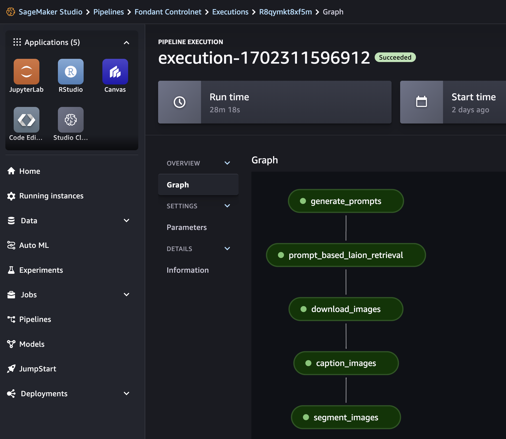

---
date:
  created: 2023-12-13
authors:
  - GeorgesLorre
---

# Fondant 0.8: Simplification, Sagemaker, RAG, and more!

Hi all, we released Fondant 0.8, which brings some major new features and improvements:

* 📝 We simplified and improved the way datasets are stored and accessed
* 🚀 The interface to compose a Fondant pipeline is now simpler and more powerful
* 🌐 AWS SageMaker is now supported as an execution framework for Fondant pipelines
* 🔍 The Fondant explorer was improved, especially for text and document data
* 📚 We released a RAG tuning repository powered by Fondant

Read on for more details!

<!-- more -->

## 📝 We simplified and improved the way datasets are stored and accessed

We listened to all your feedback and drastically simplified Fondant datasets, while solving some 
longstanding issues as part of the design. 

Most important for you is that we flattened the datasets, removing the concept of `subsets` from 
Fondant. Which means you can now access the data fields directly!

<table>
<tr>
<th>Previous</th>
<th>New ✨</th>
</tr>
<tr>
<td>

```yaml title="fondant_component.yaml"
consumes:
  images:
    fields:
      height:
        type: int32
      width:
        type: int32
```
</td>
<td>

```yaml title="fondant_component.yaml"
consumes:
  height:
    type: int32
  width:
    type: int32
```
</td>
</tr>
<tr>
<td>

```python title="src/main.py"
import pandas as pd
from fondant.component import PandasTransformComponent


class ExampleComponent(PandasTransformComponent):
This will be available in a future release.
    def transform(self, dataframe: pd.DataFrame):
        height = dataframe["images"]["height"]
        width = dataframe["images"]["width"]
        ...
```

</td>
<td>

```python title="src/main.py"
import pandas as pd
from fondant.component import PandasTransformComponent


class ExampleComponent(PandasTransformComponent):

    def transform(self, dataframe: pd.DataFrame):
        height = dataframe["height"]
        width = dataframe["width"]
        ...

```

</td>
</tr>
</table>

## 🚀 The interface to compose a Fondant pipeline is now simpler and more powerful.

You can now chain components together using the `read()`, `apply()` and `write` methods, removing 
the need for specifying dependencies separately, making composing pipelines a breeze.

<table>
<tr>
<th>Previous</th>
<th>New ✨</th>
</tr>
<tr>
<td>
  
```python title="pipeline.py"
from fondant.pipeline import Pipeline, component_op

pipeline = Pipeline(
    pipeline_name="my-pipeline",
    base_path="./data",
)

load_from_hf_hub = ComponentOp(
    name="load_from_hf_hub",
    arguments={
        "dataset_name": "fondant-ai/fondant-cc-25m",
    },
)

download_images = ComponentOp.from_registry(
    name="download_images",
    arguments= {"resize_mode": "no"},
)

pipeline.add_op(load_from_hf_hub)
pipeline.add_op(
    download_images, 
    dependencies=[load_from_hf_hub]
)

```
  
</td>
<td width="50%">

```python title="pipeline.py"
import pyarrow as pa
from fondant.pipeline import Pipeline

pipeline = Pipeline(
    name="my-pipeline",
    base_path="./data",
)

raw_data = pipeline.read(
    "load_from_hf_hub",
    arguments={
        "dataset_name": "fondant-ai/fondant-cc-25m",
    },
    produces={
        "alt_text": pa.string(),
        "image_url": pa.string(),
        "license_type": pa.string(),
    },
)

images = raw_data.apply(
    "download_images",
    arguments={"resize_mode": "no"},
)
```

</td>
</tr>
</table>

Some of the benefits of this new interface are:

- Support for overriding the produces and consumes of a component, allowing you to easily change the output of a component without having to create a custom `fondant_component.yaml` file.
- We unlock the future ability to enable eager execution of components and interactive 
  development of pipelines. Keep an eye on our next releases!

If you want to know more or get started you can check out the [documentation](https://fondant.ai/en/latest/pipeline/)

## 🌐 AWS SageMaker is now supported as an execution framework for Fondant pipelines.

You can now easily run your Fondant pipelines on AWS SageMaker using the `fondant run sagemaker <pipeline.py>` command. Run `fondant run sagemaker --help` to see the possible configuration options or check out the [documentation](https://fondant.ai/en/latest/runners/sagemaker/).




## 🔍Fondant explorer improvements

We added a lot of improvements to the Fondant explorer, including:

- A pipeline overview showing the data flow through the pipeline
- A document viewer to inspect data (handy for RAG use cases)
- Better filtering, sorting and searching of data while exploring


To get started with the Fondant explorer, check out the [documentation](https://fondant.ai/en/latest/data_explorer/).


## 📚 We released a RAG tuning repository powered by Fondant

This repository helps you tune your RAG system faster and achieve better performance using 
Fondant. Find the repository including a full explanation [here](https://github.com/ml6team/fondant-usecase-RAG).


It includes:

- A Fondant pipeline to ingest the data
- A Fondant pipeline to evaluate the data
- Multiple notebooks to go from a basic RAG pipeline to fully auto-tuned RAG pipelines

## 🔧 New reusable RAG components

A lot of new reusable components were added to the Fondant registry, letting you build new RAG 
pipelines quickly!

- Weaviate [indexing](https://github.com/ml6team/fondant/tree/main/components/index_weaviate) and [retrieval](https://github.com/ml6team/fondant/tree/main/components/retrieve_from_weaviate) components
- Qdrant [indexing](https://github.com/ml6team/fondant/blob/main/components/index_qdrant/README.md)
- Ragas [evaluation](https://github.com/ml6team/fondant/blob/main/components/evaluate_ragas/README.md)
- LlamaHub [loading](https://github.com/ml6team/fondant/tree/main/components/load_with_llamahub)
- LangChain [chunking](https://github.com/ml6team/fondant/tree/main/components/chunk_text) and 
  [embedding](https://github.com/ml6team/fondant/tree/main/components/embed_text)

You can see some of these components in action in the [RAG tuning repository](https://github.
com/ml6team/fondant-usecase-RAG).

## 🛠 Install it now!

```bash
pip install fondant==0.8.0
```

And let us know what you think! 