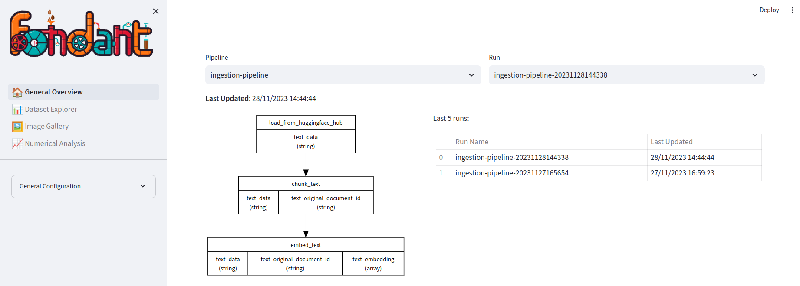

---
date:
  created: 2023-12-13
authors:
  - GeorgesLorre
---

# Fondant 0.8 brings a easier to use Pipeline interface, AWS SageMaker support, a full RAG pipeline showcase and much more

Hi all, we released Fondant 0.8, which brings some major new features and improvements:


## 🚀 The interface to compose a Fondant pipeline is now simpler and more powerful.

We listened to all your feedback and made drastic improvements to the way you can define a fondant pipeline.

<table>
<tr>
<th>Previous</th>
<th>New ✨</th>
</tr>
<tr>
<td>
  
```python
from fondant.pipeline import Pipeline, component_op

pipeline = Pipeline(
    pipeline_name="my-pipeline",
    base_path="./data",
)

load_from_hf_hub = ComponentOp(
    name="load_from_hf_hub",
    arguments={
        "dataset_name": "fondant-ai/fondant-cc-25m",
    },
)

download_images = ComponentOp.from_registry(
    name="download_images",
    arguments= {"resize_mode": "no"},
)

pipeline.add_op(load_from_hf_hub)
pipeline.add_op(
    download_images, 
    dependencies=[load_from_hf_hub]
)

```
  
</td>
<td>

```python
import pyarrow as pa
from fondant.pipeline import Pipeline

pipeline = Pipeline(
    name="my-pipeline",
    base_path="./data",
)

raw_data = pipeline.read(
    "load_from_hf_hub",
    arguments={
        "dataset_name": "fondant-ai/fondant-cc-25m",
    },
    produces={
        "alt_text": pa.string(),
        "image_url": pa.string(),
        "license_type": pa.string(),
    },
)

images = raw_data.apply(
    "download_images",
    arguments={"resize_mode": "no"},
)
```

</td>
</tr>
</table>

💪 Some of the benefits of this new interface are:

- You can now chain components together using the `read()`, `apply()` and `write` methods, removing the need for specifying dependencies separately, making composing pipelines a breeze.

If you want to know more or get started you can check out the [documentation](https://fondant.ai/en/latest/pipeline/)


## 📝 We made the dataset simpler.

- Abstracted the use of subsets to combine multiple fields under a logical prefix (e.g. `images_width` and `images_height` are now `width` and `height`).
- Support for overriding the produces and consumes of a component, allowing you to easily change the output of a component without having to create a custom `fondant_component.yaml` file.
- With these changes we unlocked the ability to build eager execution of components and interactive development of pipelines. This will be available in a future release.


## 🌐 AWS SageMaker is now supported as an execution framework for Fondant pipelines.

You can now easily run your Fondant pipelines on AWS SageMaker using the `fondant run sagemaker <pipeline.py>` command. Run `fondant run sagemaker --help` to see the possible configuration options or check out the [documentation](https://fondant.ai/en/latest/runners/sagemaker/).


## 🔍Fondant explorer improvements

We added a lot of improvements to the Fondant explorer, including:
- A pipeline overview showing the data flow through the pipeline

- A document viewer to inspect data (handy for RAG use cases)
- Better filtering, sorting and searching of data while exploring


To get started with the Fondant explorer, check out the [documentation](https://fondant.ai/en/latest/data_explorer/).


## 📚RAG ingestion pipeline powered by Fondant

We created a full RAG ingestion pipeline powered by Fondant. This pipeline and a full explanation is available in the [here](https://github.com/ml6team/fondant-usecase-RAG).


It includes:

- Multiple notebooks to go from a basic RAG pipeline to fully autotune RAG pipelines
- A Fondant pipeline to ingest the data
- A Fondant pipeline to evaluate the data
- Multiple reusable components ready to power your own pipelines


## pipelines 🔧 New reusable components

We added a lot of new reusable components to the Fondant registry, including:


- Weaviate [indexing](https://github.com/ml6team/fondant/tree/main/components/index_weaviate) and [retrieval](https://github.com/ml6team/fondant/tree/main/components/retrieve_from_weaviate) components
- Qdrant [indexing](https://github.com/ml6team/fondant/blob/main/components/index_qdrant/README.md)
- Ragas [evaluation](https://github.com/ml6team/fondant/blob/main/components/evaluate_ragas/README.md)
- LlamaHub [loading](https://github.com/ml6team/fondant/tree/main/components/load_with_llamahub)
- LangChain ?

You can see some of these components in action in the [RAG ingestion pipeline](https://github.com/ml6team/fondant-usecase-RAG)


## 🛠 Install it now!

```bash
pip install fondant==0.8.0
```

Let us know what you think! 