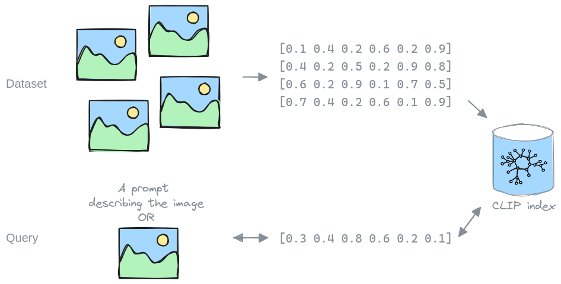

---
date:
  created: 2024-03-05
authors:
  - RobbeSneyders
  - mrchtr
---

# Building a Datacomp CLIP index with Fondant

Large (image) datasets are often unwieldy to use due to their sheer size. Assume for instance 
that we would like to extract all the cat images from such a dataset. We would have to look at 
every image to classify if it's a cat image or not. And if we want to extract all the dog images 
next, we again need to look at every image.

Instead, we can look at every image once, and calculate a (CLIP) embedding representing its 
content. Combining these embeddings into an index, we can efficiently search through the dataset 
with a query, finding specific images, without having to look at each one.

This is what LAION did for their [LAION-5b dataset](https://laion.ai/blog/laion-5b/), which made
it possible to use, like we did in our
[ControlNet example](https://github.com/ml6team/fondant-usecase-controlnet).
Unfortunately, the LAION-5b dataset and index have been
[taken offline](https://laion.ai/notes/laion-maintanence/) (temporarily) and there
[aren't any alternatives](https://github.com/rom1504/clip-retrieval/issues/324). This is
why we built an index for the Datacomp-12M dataset. While it is a lot smaller than LAION-5b, it
should already enable a lot of use cases again, and can hopefully be the start towards building
indices for more and larger datasets.

<!-- more -->

The resulting embedded dataset and index have been published on the Hugging Face Hub
[here](https://huggingface.co/datasets/fondant-ai/datacomp-small-clip). The data repository is 
structured as follows:

- [data/](https://huggingface.co/datasets/fondant-ai/datacomp-small-clip/viewer/embeddings): The 
  dataset containing ids, urls, and CLIP embeddings
- [faiss](https://huggingface.co/datasets/fondant-ai/datacomp-small-clip/blob/main/faiss): 
  The faiss index
- [id_mapping/](https://huggingface.co/datasets/fondant-ai/datacomp-small-clip/viewer/id_mapping): 
  The mapping of the faiss ids to the original urls

Read on below on how to use it with Fondant.

## Using the index

### With Fondant

The easiest way to use the index, is using Fondant. Fondant offers reusable operations which 
allow you to query the index with your data, either prompts or embeddings:

- [By prompt](https://fondant.ai/en/latest/components/hub/#retrieve_from_faiss_by_prompt#description)
- [By embedding](https://fondant.ai/en/latest/components/hub/#retrieve_from_faiss_by_embedding#description)

To see how it can be used in an end-to-end example, check our
[ControlNet example](https://github.com/ml6team/fondant-usecase-controlnet) which
uses the index to create a dataset to fine-tune a ControlNet model on a specific domain.

### With Clip-Retrieval

There are other open source tools which allow you to leverage a CLIP index. We can recommend
[clip-retrieval](https://github.com/rom1504/clip-retrieval) which lets you set up a service
hosting the index accessible by API.

## Creating the index

We leveraged Fondant to generate the CLIP index and published the pipeline as a 
[git repository](https://github.com/ml6team/fondant-clip-index). The pipeline consists of 4 steps:

- A [`load_from_hf_hub`](https://fondant.ai/en/stable/components/hub/#load_from_hf_hub#description)
  operation that loads the
  [datacomp_small](https://huggingface.co/datasets/mlfoundations/datacomp_small) dataset from
  huggingface into the Fondant workspace and format.
- A [`download_images`](https://fondant.ai/en/stable/components/hub/#download_images#description)
  operation which downloads the actual images from the urls in the dataset.
- A [`embed_images`](https://fondant.ai/en/stable/components/hub/#embed_images#description) operation which embeds the downloaded images using a CLIP model.
- A [`write_to_file`](https://fondant.ai/en/stable/components/hub/#write_to_file#description)
  operation which writes the original urls and generated embeddings to the chosen destination.

After running the pipeline, we used [`autofaiss`](https://github.com/criteo/autofaiss) to build the
CLIP index.

## Execution details

### Download images

We downloaded the images with 32 cores in parallel, each opening up to 25 concurrent connections,
and achieved a success rate of 72%, resulting in 9.251.172 images.

The downloading was executed on a VM on GCP using the Fondant Docker runner. We originally
planned to run this on Vertex AI, but moved to a VM when noticing lower network bandwidth on Vertex.

The success rate can probably be further improved by setting up a faster DNS resolver.

### Embed images

We leveraged the
[`laion/CLIP-ViT-B-32-laion2B-s34B-b79K`](https://huggingface.co/laion/CLIP-ViT-B-32-laion2B-s34B-b79K)
CLIP model. We chose this model because of a couple of reasons. It is popular, which makes it
easy to use with existing embeddings, it is small, which makes it cheap to run, and it is an open
model trained on open data.

We appreciate any feedback on our choice of model, so we can take this into account if we
generate indices for larger datasets in the future.

The embedding was executed on 4 T4 GPUs on Google Cloud using our Vertex AI runner, with a batch
size of 32. The execution took 8:15 hours.

## What's next

### Making data building collaborative

With Fondant we aim to make data building collaborative, and we will share more features built
on top of the Datacomp datasets to showcase this in the future. To stay up to date, join our
[Discord](https://discord.gg/HnTdWhydGp).

### Larger datasets

Based on the popularity and feedback we receive on this 12.8M index, we might generate a CLIP
index for the datacomp-128M dataset. If there are other datasets you are interested in, or want
to generate an index for a different dataset yourself, please let us know in our
[Discord](https://discord.gg/HnTdWhydGp).

