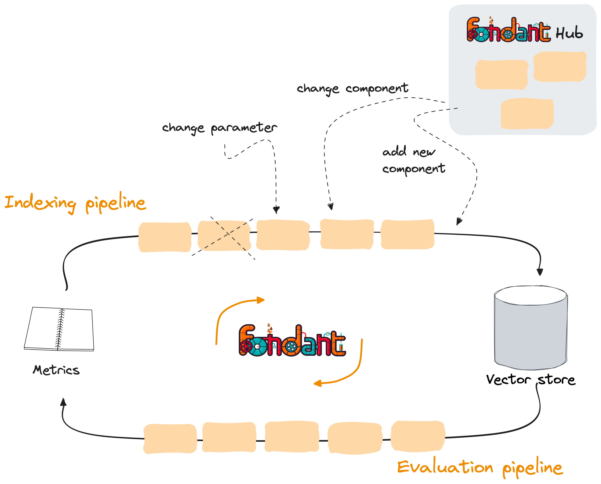

---
date:
  created: 2024-01-15
authors:
  - mrchtr
---

# Let's tune RAG pipelines with Fondant

Retrieval Augmented Generation (RAG) has quickly become the go-to architecture for providing large
language models (LLM) with specific knowledge. Optimizing a custom setup requires days to find the
right set of parameters and system configuration.

We have created an example use case to showcase how you can enhance your RAG setup by using Fondant.
Checkout out the resources:

- [GitHub repository](https://github.com/ml6team/fondant-usecase-RAG)
- [Blogpost](https://medium.com/)

<!-- more -->

Off-the-shelf solutions might be easy to set up for a quick proof of concept, but their performance
is usually insufficient for production usage since they are not adapted to the complexities of
specific situations.

By employing several different methods in an iterative manner, we can more than double the accuracy
of an RAG system and maximize its performance. We have built two Fondant pipelines that can assist
you in finding the optimal combinations of parameters for your unique setup.

