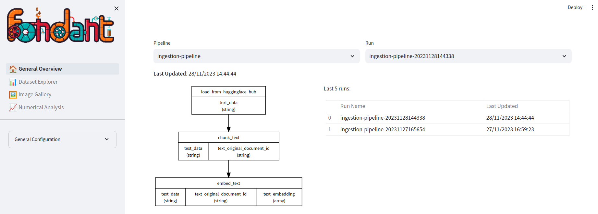

# Data explorer

The data explorer enables you to explore your datasets as well as inspecting inputs and outputs
of the components. The explorer can be a helpful tool to debug your datasets and to get a
better
understanding of the data that is being processed. It can also be used to compare different materialized
datasets which can be useful to understand the impact of changes in your workflow.

The explorer consists of 4 main tabs:

### General Overview

In the general overview, you can select the dataset and materialization run you want to explore. You will
be able to see the different components that were run in the materialization run and get an overview of
your latest runs.



### Dataset Explorer

The data explorer shows an interactive table of the loaded fields from a given component.
In this you can:

- Browse through different parts of the data
- Visualize images
- Search for specific rows using a search query
- Visualize long documents using a document viewer


### Image Gallery

The image explorer tab enables the user to choose one of the image columns and analyse these images.


### Numerical Analysis

The numerical analysis tab shows global statistics of the numerical columns of the loaded subset (
mean,
std, percentiles, ...).


## How to use?

You can setup the data explorer container with the `fondant explore` CLI command, which is installed
together with the Fondant python package.

=== "Console"

    ```bash
    fondant explore start --base_path $BASE_PATH
    ```

=== "Python"

    ```python
    from fondant.explore import run_explorer_app
    
    BASE_PATH = "your_working_directory"
    run_explorer_app(base_path=BASE_PATH)
    ```

Where the base path can be either a local or remote working directory. Make sure to pass the proper mount
credentials arguments when using a remote working directory or a local working directory
that references remote datasets. You can do that either with `--auth-gcp`, `--auth-aws`
or `--auth-azure` to
mount your default local cloud credentials to the workflow. Or You can also use
the `--extra-volumnes` flag to specify credentials or local files you need to mount.

To stop the data explorer service you can use the following commands: 

Example:

=== "Console"

    ```bash
    fondant explore stop
    ```

=== "Python"

    ```python
    from fondant.explore import stop_explorer_app

    stop_explorer_app()
    ```


