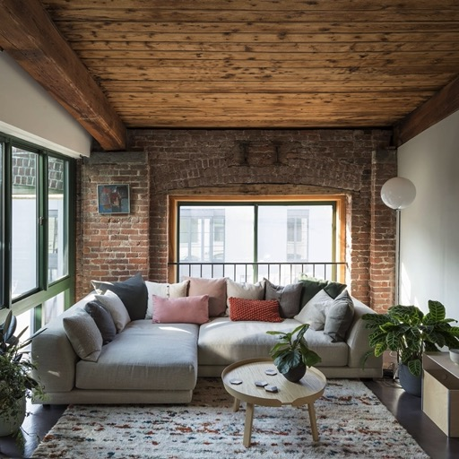
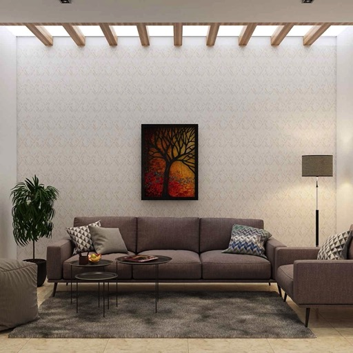
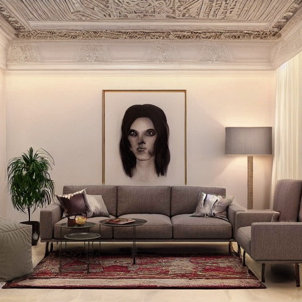
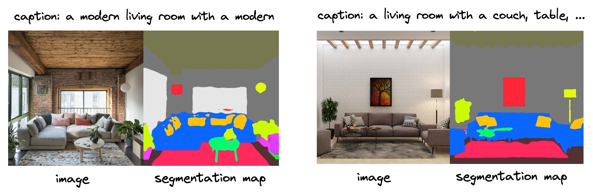
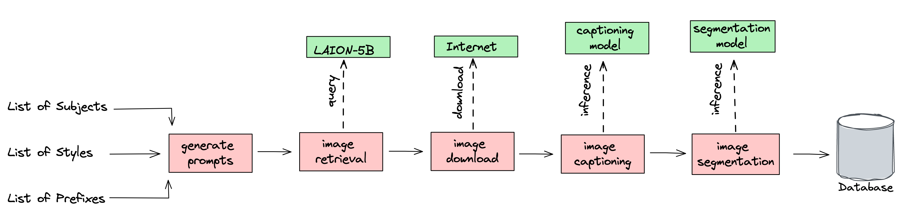

# ControlNet Interior Design Pipeline

# Table of Contents
1. [Introduction](#introduction)
    1. [What is Controlnet?](#what-is-controlnet)
    2. [Multi-Modal dataset](#multi-modal-dataset)
    3. [LAION-5B](#laion-5b)
    4. [Examples](#examples)
2. [Pipeline Overview](#pipeline-overview)
    1. [Prompt Generation](#prompt-generation)
    2. [Image URL Retrieval](#image-url-retrieval)
    3. [Download Images](#download-images)
    4. [Add Captions](#add-captions)
    5. [Add Segmentation Maps](#add-segmentation-maps)
3. [Install and Run](#install-and-run)
4. [Reusing this pipeline](#reusing-this-pipeline)

## Introduction
This example demonstrates an end-to-end fondant pipeline to collect and process data for the fine-tuning of a [ControlNet](https://github.com/lllyasviel/ControlNet) model, focusing on images related to interior design.

The resulting model allows you to generate the room of your dreams:


| Input image                                                    | Output image                                                     |
|----------------------------------------------------------------|------------------------------------------------------------------|
|  |  |
|  |  |
|  |  |

Want to try out the resulting model yourself, head over to our 
[Hugging Face space](https://huggingface.co/spaces/ml6team/controlnet-interior-design)!

### What is ControlNet?
ControlNet is an image generation model developed by [Zhang etl a., 2023](https://arxiv.org/abs/2302.05543) that gives the user more control over the image generation process. It is based on the [Stable Diffusion](https://stability.ai/blog/stable-diffusion-public-release) model, which generates images based on text and an optional image. The ControlNet model adds a third input, a conditioning image, that can be used for specifying specific wanted elements in the generated image.

The Controlnet architecture is made so that it can be used for a wide variety of tasks and conditionings, such as segmentation maps, edge maps, scribbles, depth maps and more. A big benefit of Controlnet is that it can be trained with a relatively small dataset, since it reuses a lot of the weights from the Stable Diffusion model. This makes it very accessible for people with limited access to big amounts of compute and data.

Conditioning examples:

* Semantic segmentation maps
* Scribbles
* Depth maps
* Canny edge maps
* M-LSD Lines
* HED Boundaries
* Human Pose
* Normal Maps
* Anime Line Drawings
* Whatever you imagination can come up with!


Useful links:

* https://github.com/lllyasviel/ControlNet
* https://huggingface.co/docs/diffusers/main/en/api/pipelines/stable_diffusion/controlnet
* https://arxiv.org/abs/2302.05543


### Multi-Modal dataset
In order to train a Controlnet model we need three inputs: an `image`, a `caption` and a `conditioning image`. When building this dataset, we typically begin with choosing a certain `domain of images`, e.g. interior design, faces, paintings, whatever you want. Next we need a textual description of the content of the image, also known as a `caption`. In some cases, the caption is already present in the dataset, but in other cases we need to generate it ourselves. Lastly, we need a `conditioning image`, which is an image that contains the elements that we want to see in the generated image. For example, if we want to generate a bedroom with a certain style, we could use a scribble of the bedroom layout as a conditioning image.

It's important that the dataset has enough quality images and captions and contains all three inputs for each sample.



### LAION-5B
When building your dataset, the images are the main component, since they are the starting point for getting captions and conditioning maps. One way of getting your dataset is by using a ready-to-go dataset, such as your own private dataset or a public dataset.

Where to find a ready-to-go image dataset:

* https://huggingface.co/docs/datasets/index
* https://pytorch.org/vision/stable/datasets.html
* https://www.kaggle.com/datasets


However, if you want some more specific data, this is not always possible. Luckily, [LAION](https://laion.ai/) has invested a lot of brain power and resources to open source some great tools and data such as [LAION-5B](https://laion.ai/blog/laion-5b/) and [clip-retrieval](https://github.com/rom1504/clip-retrieval). They built the LAION-5B dataset by scraping and filtering Common Crawl in a smart way (using CLIP and filters) and compiled it into a [FAISS](https://github.com/facebookresearch/faiss) Semantic Search index. This index can be used to retrieve images based on a visual and textual input, which results in an incredible powerful and efficient way of getting images for your dataset.

To explore the LAION-5B dataset you can use the [clip frontend website](https://rom1504.github.io/clip-retrieval/?back=https%3A%2F%2Fknn.laion.ai&index=laion5B-H-14&useMclip=false).

For retrieving images, you need to have a small set of textual descriptions or example images. The LAION-5B dataset will then retrieve the URLs of the most similar images based on the CLIP embeddings of the input. These URLs can then be used to download the actual images.


### How to use ControlNet
ControlNet is currently supported in multiple frameworks, such as PyTorch and JAX, by the [Diffusers](https://github.com/huggingface/diffusers) library from [Hugging Face](https://huggingface.co/docs/diffusers/index). The Diffusers library has built some awesome tools around Diffusion models in general, and supports all the functionality that you need to train and use a ControlNet model, such as inpainting, img2img, sampling schedulers, etc.

Another great repository is [this one](https://github.com/lllyasviel/ControlNet), that contains multiple training scripts and examples. This repository also contains models that are compatible with the well-known `Stable-Diffusion WebUI` from [AUTOMATIC1111](https://github.com/AUTOMATIC1111/stable-diffusion-webui).

### Examples
If you want to test ControlNet yourself, you can use the following examples:

* [Hugging Face - ControlNet for Interior Design](https://huggingface.co/spaces/ml6team/controlnet-interior-design)
* [Demo of Fondant]()
* [AUTOMATIC1111 colab](https://colab.research.google.com/github/TheLastBen/fast-stable-diffusion/blob/main/fast_stable_diffusion_AUTOMATIC1111.ipynb)


## Pipeline Overview

The image below shows the entire pipeline and its workflow. Note that this workflow is currently adapted to the interior design domain, but can be easily adapted to other domains by changing the prompt generation component.




There are 5 components in total, these are:

1. **Prompt Generation**: This component generates a set of seed prompts using a rule-based approach that combines various rooms and styles together, like “a photo of a {room_type} in the style of {style_type}”. As input, it takes in a list of room types (bedroom, kitchen, laundry room, ..), a list of room styles (contemporary, minimalist, art deco, ...) and a list of prefixes (comfortable, luxurious, simple). These lists can be easily adapted to other domains. The output of this component is a list of seed prompts.

2. **Image URL Retrieval**: This component retrieves images from the [LAION-5B](https://laion.ai/blog/laion-5b/) dataset based on the seed prompts. The retrieval itself is done based on CLIP embeddings similarity between the prompt sentences and the captions in the LAION dataset. This component doesn’t return the actual images yet, only the URLs. The next component in the pipeline will then download these images.

3. **Download Images**: This component downloads the actual images based on the URLs retrieved by the previous component. It takes in the URLs as input and returns the actual images, along with some metadata (like their height and width).

4. **Add Captions**: This component captions all images using [BLIP](https://huggingface.co/docs/transformers/model_doc/blip). This model takes in the image and generates a caption that describes the content of the image. This component takes in a Hugging Face model ID, so it can use any [Hugging Face Hub model](https://huggingface.co/models).

5. **Add Segmentation Maps**: This component segments the images using the [UPerNet](https://huggingface.co/docs/transformers/model_doc/upernet) model. Each segmentation map contains segments of 150 possible categories listed [here](https://huggingface.co/openmmlab/upernet-convnext-small/blob/main/config.json#L110).


## Install and Run

### Requirements

```
pip install git+https://github.com/ml6team/fondant.git
pip install fondant[pipelines]
```

### Pipeline Configuration

The pipeline_configs.py contains a data class used to store two general configuration parameters for the pipeline.

- ```BASE_PATH```: This base path used to store the artifacts 
- ```HOST```: This is the Kubeflow pipelines host url

Both of these need to be set to suitable values.


### Run

Running the pipeline then consists of two steps:

1. Building the images for each of the pipeline components
```
bash build_images.sh --namespace <NAMESPACE> --repo <REPO> -C all
```

For help with the build_images.sh script, run:
```
bash build_images.sh --help
```

2. Running the pipeline:
```
python pipeline.py
```


## Reusing this pipeline

Adapt this pipeline for your own use case is simply a matter of editing the generate_prompts [component](./components/generate_prompts/src/main.py). You can leverage the existing structure, but generate prompts covering a different domain.
