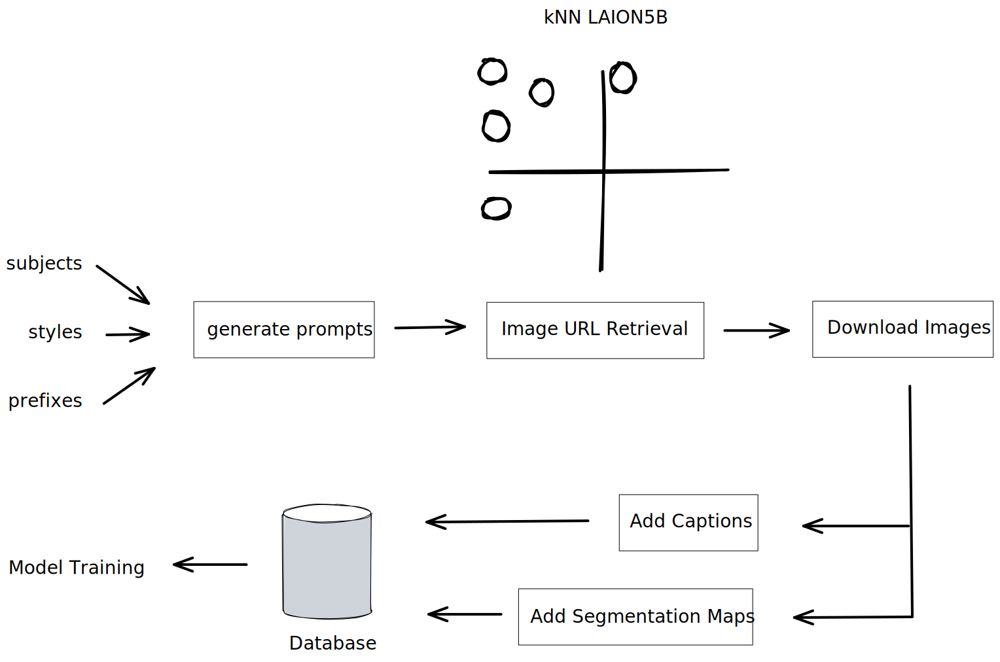

# ControlNet Interior Design Pipeline

## Introduction
This example demonstrates an end-to-end fondant pipeline to collect and process data for the training of a [ControlNet](https://github.com/lllyasviel/ControlNet) model, focusing on images related to interior design.

## Pipeline Overview

The image below shows the entire pipeline and its workflow.




There are 5 components in total, these are:

1. **Prompt Generation**: This component generates a set of seed prompts using a rule-based approach that combines various rooms and styles together, like “a photo of a {room_type} in the style of {style_type}”.

2. **Image URL Retrieval**: This component retrieves images from the LAION-5B dataset based on the seed prompts. The retrieval itself is done based on CLIP embeddings similarity between the prompt sentences and the captions in the LAION dataset. This component doesn’t return the actual images yet, only the URLs. The next component in the pipeline will then download these images.

3. **Download Images**: This component downloads the actual images based on the URLs retrieved by the previous component. It takes in the URLs as input and returns the actual images, along with some metadata (like their height and width).

4. **Add Captions**: This component captions all images using a captioning model like [BLIP](https://huggingface.co/docs/transformers/model_doc/blip) or [GIT](https://huggingface.co/docs/transformers/model_doc/git). Note that various decoding strategies can be used here like greedy decoding vs. beam search (depending on the performance requirements, one can choose one over the other).

5. **Add Segmentation Maps**: This component segments the images using the [UPerNet](https://huggingface.co/docs/transformers/model_doc/upernet) model. Each segmentation map contains segments of 150 possible categories listed [here](https://huggingface.co/openmmlab/upernet-convnext-small/blob/main/config.json#L110).


## Install and Run

### Requirements


```
pip install git+https://github.com/ml6team/fondant.git
pip install fondant[pipelines]
```

### Pipeline Configuration

The pipeline_configs.py contains a data class used to store two general configuration parameters for the pipeline.

- ```BASE_PATH```: This base path used to store the artifacts 
- ```HOST```: This is the Kubeflow pipelines host url

Both of these need to be set to suitable values.


### Run

Running the pipeline then consists of two steps:

1. Building the images for each of the pipeline components
```
bash build_images.sh -c all 
```

2. Running the pipeline:
```
python pipeline.py
```
