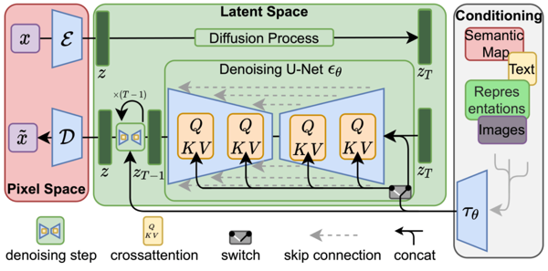
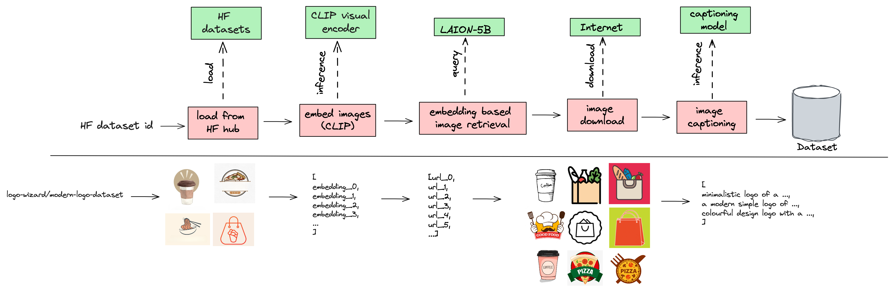

<p align="center">
    
</p>
<p align="center">
    <i>Sweet data-centric foundation model fine-tuning</i>
    <br>
    <a href="https://fondant.readthedocs.io/en/latest/"><strong>Explore the docs »</strong></a>
    <br>
</p>


# Stable Diffusion pipeline

# Table of Contents
1. [Introduction](#introduction)
    1. [What is Stable Diffusion?](#what-is-stable-diffusion)
    2. [Multi-Modal dataset](#multi-modal-dataset)
    3. [LAION-5B](#laion-5b)
    4. [Examples](#examples)
2. [Pipeline Overview](#pipeline-overview)
    1. [Load from hub](#load-from-hub)
    2. [Image embedding](#image-embedding)
    3. [Image retrieval (LAION-5B)](#image-url-retrieval)
    4. [Download Images](#download-images)
    5. [Image captioning](#add-captions)
3. [Install and Run](#install-and-run)
4. [Reusing this pipeline](#reusing-this-pipeline)

## Introduction

### What is Stable Diffusion?
Stable Diffusion is a text-to-image model released by Stability AI. It's based on the latent diffusion architecture from [Robin Rombach et al.](https://arxiv.org/abs/2112.10752), which is an efficient diffusion model that works in the latent space. It consists of a text encoder that encodes the text into a latent vector, an Autoencoder, that projects the input image into a lower resolution latent space (and reconstructs the original image from it) and a U-Net that drives the diffusion process in latent space.




The latent diffusion model was trained on a large dataset of text-image pairs for text-conditioned image generation. The model is available on the Hugging Face model hub ([SD v1.5](https://huggingface.co/runwayml/stable-diffusion-v1-5), [SD v2.0](https://huggingface.co/stabilityai/stable-diffusion-2), [SD v2.1](https://huggingface.co/stabilityai/stable-diffusion-2-1)).


### Multi-Modal dataset
Since Stable Diffusion is a text-to-image model, it is trained on text-image pairs that contain a similar content. These text-image pairs can be found on the internet, by looking for the caption of images, since they should describe the content of the image. Another way of getting these pairs is by human annotation, which can produce very high quality data, but is also very expensive and time consuming. Luckily, researchers and organisations have spend plenty of time researching the domain of image captioning and have created some great datasets and models, such as [BLIP](https://huggingface.co/docs/transformers/model_doc/blip) by SalesForce, [GIT](https://huggingface.co/docs/transformers/model_doc/git) by Microsoft and many more. These models can be used to generate captions for images, which can then be used to create text-image pairs for your own multi-modal dataset!


### LAION-5B
When building your dataset, the images are the main component, since they are the starting point for getting text-image pairs. One way of getting your dataset is by using a ready-to-go dataset, such as your own private dataset or a public dataset.

Where to find a ready-to-go image dataset:

* https://huggingface.co/docs/datasets/index
* https://pytorch.org/vision/stable/datasets.html
* https://www.kaggle.com/datasets


However, if you want some more specific data, this is not always possible. Luckily, [LAION](https://laion.ai/) has invested a lot of brain power and resources to open source some great tools and data such as [LAION-5B](https://laion.ai/blog/laion-5b/) and [clip-retrieval](https://github.com/rom1504/clip-retrieval). They built the LAION-5B dataset by scraping and filtering [Common Crawl](https://commoncrawl.org/) in a smart way (using CLIP and filters) and compiled it into a [FAISS](https://github.com/facebookresearch/faiss) Semantic Search index. This index can be used to retrieve images based on a visual and textual input, which results in an incredible powerful and efficient way of getting images for your dataset.

To explore the LAION-5B dataset you can use the [clip frontend website](https://rom1504.github.io/clip-retrieval/?back=https%3A%2F%2Fknn.laion.ai&index=laion5B-H-14&useMclip=false).

For retrieving images, you need to have a small set of textual descriptions or example images. The LAION-5B dataset will then retrieve the URLs of the most similar images based on the CLIP embeddings of the input. These URLs can then be used to download the actual images.


### Examples
If you want to test out Stable Diffusion, you can use the following demos:

* [RunwayML](https://runwayml.com/ai-magic-tools/text-to-image/)
* [Stable Diffusion v2.1 - Hugging Face space](https://huggingface.co/spaces/stabilityai/stable-diffusion)
* [Stable Diffusion v1.5 - Hugging Face space](https://huggingface.co/spaces/runwayml/stable-diffusion-v1-5)

## Pipeline Overview

The image below shows the entire pipeline and its workflow. Note that this workflow is currently adapted to the interior design domain, but can be easily adapted to other domains by changing the prompt generation component.




There are 5 components in total, these are:

1. **Load from hub**: This component loads a dataset from the Hugging Face dataset hub. It takes in a Hugging Face dataset ID, so it can use any [Hugging Face dataset](https://huggingface.co/datasets) (or a custom one).

2. **Image embedding**: This component takes in the images of the dataset and returns the CLIP embeddings of these images. These embeddings can be used for filtering the dataset or for retrieving similar images from the LAION-5B dataset.

3. **Image URL Retrieval**: This component retrieves images from the [LAION-5B](https://laion.ai/blog/laion-5b/) dataset based on the seed prompts. The retrieval itself is done based on CLIP embeddings similarity between the prompt embedding and the visual embeddings in the LAION dataset. This component doesn’t return the actual images yet, only the URLs. The next component in the pipeline will then download these images.

4. **Download Images**: This component downloads the actual images based on the URLs retrieved by the previous component. It takes in the URLs as input and returns the actual images, along with some metadata (like their height and width).

5. **Add Captions**: This component captions all images using [BLIP](https://huggingface.co/docs/transformers/model_doc/blip). This model takes in the image and generates a caption that describes the content of the image. This component takes in a Hugging Face model ID, so it can use any [Hugging Face Hub model](https://huggingface.co/models).


## Install and Run

### Requirements

```
pip install fondant[pipelines]
```

### Pipeline Configuration

The pipeline_configs.py contains a data class used to store two general configuration parameters for the pipeline.

- ```BASE_PATH```: This base path used to store the artifacts 
- ```HOST```: This is the Kubeflow pipelines host url

Both of these need to be set to suitable values.


### Run

Running the pipeline then consists of two steps:

1. Building the images for each of the pipeline components
```
bash build_images.sh --namespace <NAMESPACE> --repo <REPO> -C all
```

For help with the build_images.sh script, run:
```
bash build_images.sh --help
```

2. Running the pipeline:
```
python pipeline.py
```


## Reusing this pipeline
You can reuse this pipeline by adapting the following components:

- **Load from hub**: This component loads a dataset from the Hugging Face dataset hub. You can change this dataset to any other compatible dataset on the Hugging Face dataset hub. If the image column of the dataset is called something else than `image`, you can adapt this naming in the code of the Load From Hub component.

Feel free to swap out components of the pipeline with our other components, try building your own custom filtering component or use different captioning models than our example! Let us know if you have any questions or feedback, we are happy to help!
