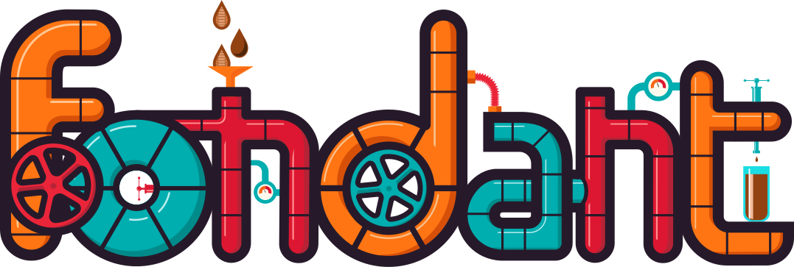

    

    <i>Sweet data-centric foundation model fine-tuning</i>
     
    <a href="https://fondant.readthedocs.io/en/latest/"><strong>Explore the docs »</strong></a>
     
     
    
    
    
    
    

