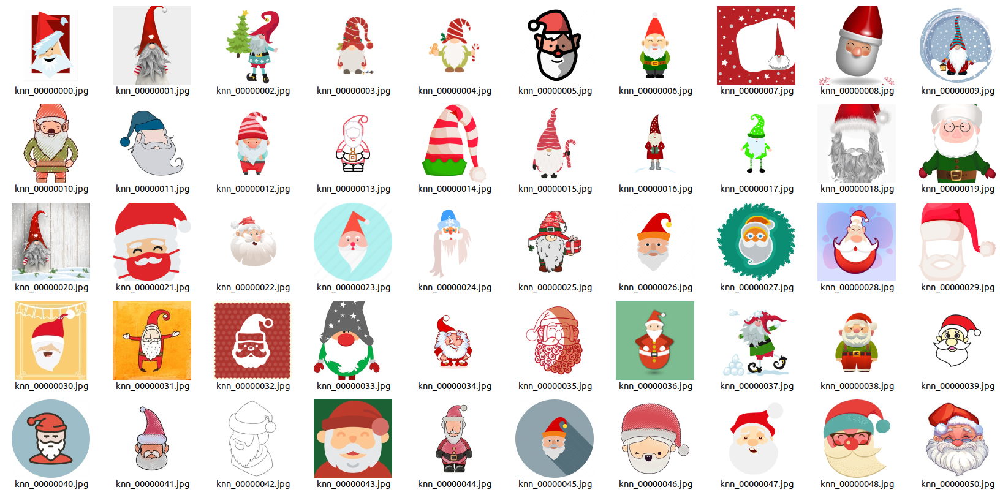
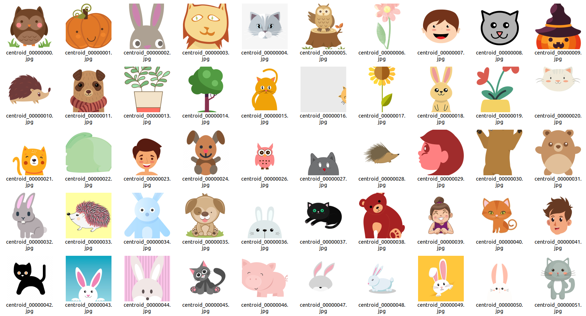
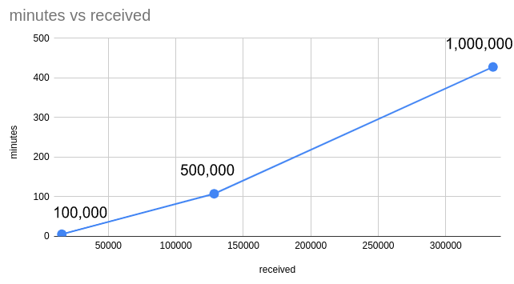

# clip_retrieval_component

### Description

This component retrieves images from the LAION dataset using a clip
retrieval system. The images are retrieved using an efficient index built from the previously
extracted embeddings that enables for fast and accurate
querying against a large database.

Checkout this [link](https://github.com/rom1504/clip-retrieval) for information on clip retrieval.
You can also
test out clip retrieval in
this [demo](https://rom1504.github.io/clip-retrieval/?back=https%3A%2F%2Fknn5.laion.ai&index=laion5B&useMclip=false).
The output of this component is a list of URLs containing the link to the retrieved image.

Two current strategies are implemented for the retrieval of the images:

1) **Knn strategy**: In this approach, an index is built from each embedding of the input dataset.
   This allows to retrieve images of similar **context** and **style** to the input image. The image
   below shows an example of the seed image and the retrieved images:

2) **Centroid strategy**: In this approach, the image embeddings for all the images are **averaged
   out** and
   the image are retrieved from the index of that embedding. This allows to retrieve images of
   similar **style**
   but with varied contexts compared to the seed images. The average embedding can be interpreted as
   the average representation of a certain image style/domain in an embedding space.

The image below shows an example of images retrieved from the centroid of a collection of varied
Clip Art images.

### **Benchmarks**

The graph below demonstrates the number of images received with clip retrieval and the time it takes
to receive those images. The numbers on the graph are the requested number of images.

One important thing to not out is that the number of received images is around a **30%** of the
number of
requested images. The reason for that is because the clip retrieval also takes care of deduplication
of the returned images based on their embeddings
(a lot of images in the LAION-5B are similar since they are scraped from different data sources).
This
deduplication is pairwise operations with time complexity O(n2).

In short, it takes around **7 hours** to retrieve **~350k** images with an initial request of **1
million images.**

### **Inputs/Outputs**

The Laion dataset is downloaded to the internal storage of the computed instance and queried from
there.

Two important two parameters to specify here are the number of images to return through both knn and
centroid strategy:

* `nb_images_knn`: the number of images to retrieve from **each embedding** of the seed images.
* `nb_images_centroid`: the number of images to retrieve from the **average embedding** of the seed
  images.

As a concrete example, if we have 1,000 images in our seed images and assuming that the amount
of images retrieved are around 30% of the requested images. Then to create a dataset of around 500k
images with
a balanced amount of images between both strategies (250k from each):

_nb_images_knn = 250,000 / (1000*0.3) = ~ 830_

_nb_images_centroid = 250,000 / 0.3 = ~ 830,000_

Notice that the number of images retrieved from the centroid will be much larger that the one
the `knn`
approach and hence it will take much longer time overall (see benchmark above).

See [`component.yaml`](component.yaml) for a more detailed description on all the input/output
parameters.

### **Practical considerations**

* Keep in mind that the total amount of image urls that will be retrieved will still be reduced by
  around 25%
  since many of the urls might be broken or the images might not pass the filters specified in the
  [`clip_downloader_component`](../clip_downloader_component).
* Clip retrieval can also work with text or image input, this component currently only implements
  the
  embedding approach but can easily be changed to accomodate for the other methods.
* This component takes a long time to run since the LAION dataset need to be downloaded first from
  GCS (total size is around 2.5 TB, it can take around 2-3 hours to download)
  and the querying itself also takes a signficant amount of time.
* Since the knn indices and the metadata (URL and captions) are very large files that need to be queried
  efficiently,
  memory mapping to allow to map data on SSDs into virtual memory and query data that scales beyond
  RAM capacity.
  This requires the using GKE nodepools with NVMe drives and provisioning them to this component
  during the pipeline run.
  More information on NVMe SSDs the context of GKE can be
  found [here](https://cloud.google.com/kubernetes-engine/docs/how-to/persistent-volumes/local-ssd). 
